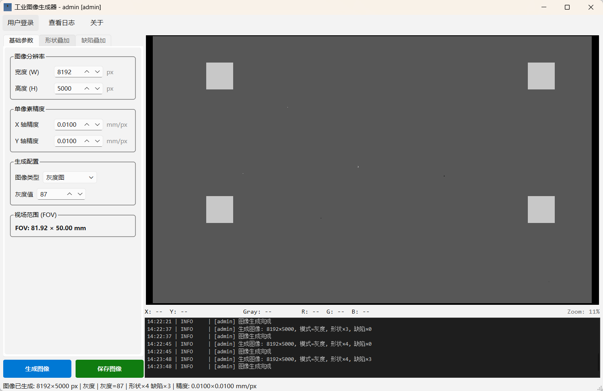

# 工业图像生成器 **IndustrialImageGenerator**

<div align="center">
  <p><strong>模拟工业相机采集图像的软件, 支持自定义分辨率、像素精度、形状叠加和缺陷叠加.</strong></p>
  <p>
    
    
    
  </p>
</div>



## 快速下载

```bash
# download IndustrialImageGenerator.exe from Release

# or lanuch IndustrialImageGenerator in terminal
python src/main.py
```

## 功能特性

- 图像分辨率、单像素精度、视场范围（FOV）自定义
- 灰度图 / RGB 彩色图切换
- 形状叠加：圆形、矩形（独立宽高）、三角形
- 缺陷叠加：划痕、沾污、黑点、气泡（随机位置）
- 图像预览：鼠标滚轮缩放、像素级网格显示、实时像素信息
- 用户登录：SQLite 存储，管理员/普通用户角色权限
- 日志系统：loguru 文件日志 + 界面实时回显
- 多线程图像生成，UI 不阻塞
- 带进度条的蓝色工业风启动画面

## 技术栈

- **Python 3.12** + **OpenCV** + **NumPy** — 图像生成
- **PySide6** — 桌面 GUI 框架
- **loguru** — 日志系统
- **SQLite** — 用户数据存储
- **PyInstaller** — 打包为独立 exe
- **uv** — 包管理与虚拟环境

## 快速开始

```bash
# 安装依赖
uv sync

# 运行
uv run image-generator

# 生成 Logo 和图标
uv run python generate_logo.py

# 打包为 exe
uv run python build.py

# build Release
echo "1.3.0" > VERSION
uv lock && uv run python build.py
```

## 默认账户

| 角色   | 用户名  | 密码      |
|--------|---------|-----------|
| 管理员 | admin   | admin123  |
